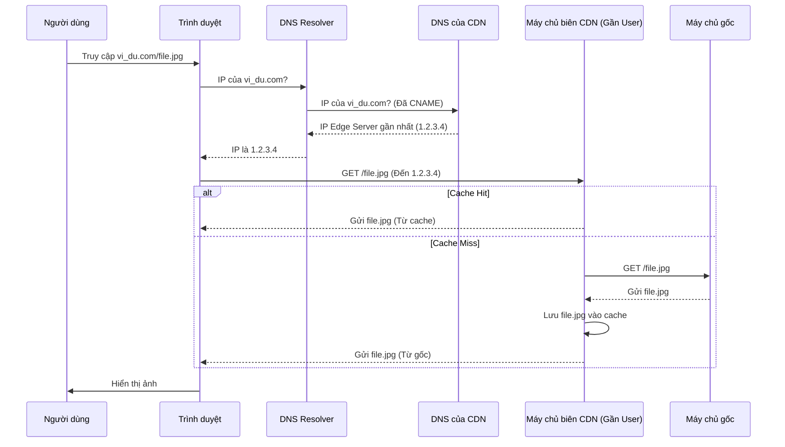

# Tìm hiểu về Mạng Phân Phối Nội Dung (CDN): Tăng tốc và Bảo vệ Website của bạn

Trong thế giới internet ngày nay, tốc độ và sự ổn định của website hay ứng dụng là yếu tố then chốt quyết định trải nghiệm người dùng và thành công của dịch vụ. Một trong những công nghệ quan trọng nhất giúp đạt được điều này chính là **Mạng Phân Phối Nội Dung (Content Delivery Network - CDN)**.

Bài viết này sẽ cung cấp cho bạn cái nhìn toàn diện về CDN, từ khái niệm cơ bản đến cách thức hoạt động chi tiết, lợi ích mang lại và cách lựa chọn nhà cung cấp phù hợp.

## Phần 1: CDN là gì và Tại sao cần dùng?

### 1.1. Định nghĩa CDN một cách đơn giản

Hãy tưởng tượng website của bạn là một **"siêu thị lớn"** đặt tại một địa điểm duy nhất (ví dụ: Hà Nội), chứa tất cả hàng hóa (nội dung website). Khi khách hàng ở xa (ví dụ: TP.HCM hay thậm chí nước ngoài) muốn mua hàng (truy cập website), họ phải chờ đợi rất lâu để hàng hóa được vận chuyển (dữ liệu được tải về).

**CDN** giống như việc bạn mở ra một chuỗi các **"cửa hàng tiện lợi"** hoặc **"kho hàng mini"** đặt rải rác khắp nơi trên thế giới. Những cửa hàng này lưu trữ sẵn các mặt hàng phổ biến nhất (nội dung tĩnh như hình ảnh, video, CSS...). Khi khách hàng cần mua, họ sẽ đến cửa hàng gần nhất để lấy hàng thay vì phải chờ từ siêu thị chính.

=> **CDN (Content Delivery Network - Mạng Phân Phối Nội Dung)** là một mạng lưới gồm nhiều máy chủ được đặt tại nhiều vị trí địa lý khác nhau trên toàn cầu (gọi là **Điểm hiện diện - Point of Presence hay PoP**). Các máy chủ này lưu trữ bản sao (cache) nội dung của website gốc và phân phối chúng đến người dùng từ máy chủ ở vị trí gần họ nhất về mặt địa lý và mạng lưới.

### 1.2. Vấn đề CDN giải quyết

CDN ra đời để giải quyết hai vấn đề chính làm chậm website:

*   **Độ trễ do khoảng cách địa lý (Latency):** Dữ liệu cần thời gian để di chuyển qua các mạng lưới vật lý. Khi người dùng ở xa máy chủ gốc, quãng đường truyền dữ liệu dài hơn, đi qua nhiều thiết bị mạng trung gian hơn, dẫn đến thời gian chờ đợi lâu hơn (độ trễ cao) và website tải chậm.
*   **Tắc nghẽn và quá tải máy chủ gốc (Origin Server Overload):** Nếu tất cả người dùng trên thế giới đều truy cập trực tiếp vào một máy chủ gốc duy nhất, đặc biệt trong những thời điểm cao điểm (sự kiện, khuyến mãi...), máy chủ đó có thể bị quá tải, dẫn đến tốc độ chậm hoặc thậm chí ngừng hoạt động ("sập" server).

### 1.3. Mục đích chính của việc sử dụng CDN

Mục đích cốt lõi của việc triển khai CDN là **cải thiện đáng kể hiệu suất, độ tin cậy và bảo mật** của website/ứng dụng, từ đó mang lại **trải nghiệm người dùng tốt nhất** có thể, bất kể họ đang ở đâu trên thế giới.

## Phần 2: Cách thức hoạt động chi tiết của CDN

Vậy làm thế nào CDN có thể "mang" nội dung đến gần người dùng hơn? Quá trình này bao gồm sự phối hợp của nhiều yếu tố:

### 2.1. Vai trò của Máy chủ biên (Edge Server / PoP)

*   **Edge Server:** Là các máy chủ vật lý thuộc mạng lưới CDN, được đặt tại các **PoP** - trung tâm dữ liệu chiến lược trên toàn cầu (thành phố lớn, điểm giao thoa mạng IXP).
*   **Nhiệm vụ:**
    *   Lưu trữ bản sao nội dung tĩnh (hình ảnh, CSS, JS...) từ máy chủ gốc (gọi là **Caching**).
    *   Trực tiếp phản hồi yêu cầu của người dùng bằng cách gửi nội dung từ cache nếu có.
    *   Hoạt động như một "lá chắn", hấp thụ phần lớn lưu lượng truy cập, giảm tải cho máy chủ gốc.

### 2.2. Sử dụng DNS để điều hướng thông minh

Đây là bước "ma thuật" đầu tiên:

1.  **Cấu hình:** Chủ sở hữu website cấu hình bản ghi DNS của tên miền (ví dụ: `www.vi_du.com`) trỏ đến một tên miền đặc biệt do nhà cung cấp CDN quản lý.
2.  **Yêu cầu người dùng:** Khi người dùng gõ `www.vi_du.com` vào trình duyệt, yêu cầu phân giải địa chỉ IP sẽ được gửi đến hệ thống DNS.
3.  **Phân giải bởi CDN DNS:** Hệ thống DNS của CDN nhận yêu cầu. Dựa trên vị trí địa lý của người dùng (thường xác định qua địa chỉ IP của DNS resolver đang hỏi) và tình trạng tải của các Edge Server, nó sẽ chọn ra **Edge Server tối ưu nhất** (thường là gần nhất, nhanh nhất) cho người dùng đó.
4.  **Trả về IP Edge Server:** DNS của CDN trả về địa chỉ IP của Edge Server đã chọn cho trình duyệt.
5.  **Kết nối đến Edge Server:** Trình duyệt của người dùng giờ đây sẽ kết nối và gửi yêu cầu nội dung trực tiếp đến Edge Server đó, thay vì máy chủ gốc.

### 2.3. Cơ chế lưu trữ bản sao nội dung (Caching)

*   Edge Server lưu trữ các bản sao của nội dung tĩnh.
*   Nội dung thường được cache lần đầu khi có yêu cầu từ người dùng gần đó mà Edge Server chưa có bản sao (Cache Miss). Edge Server sẽ lấy từ gốc về, lưu vào cache rồi gửi cho người dùng.
*   Thời gian lưu trữ (TTL - Time To Live) được kiểm soát bởi tiêu đề HTTP (`Cache-Control`, `Expires`) từ máy chủ gốc hoặc cấu hình CDN. Sau thời gian này, bản sao bị coi là "cũ".
*   Có cơ chế để xóa/làm mới cache (Purge/Invalidation) khi nội dung gốc thay đổi.

### 2.4. Quá trình xử lý yêu cầu: Cache Hit và Cache Miss

Khi Edge Server nhận yêu cầu từ người dùng (đã được DNS điều hướng):

*   **Cache Hit (Tìm thấy trong Cache):**
    1.  Edge Server kiểm tra cache và **tìm thấy** bản sao hợp lệ của nội dung được yêu cầu.
    2.  Nó **ngay lập tức** gửi nội dung đó cho người dùng từ cache.
    *   *Kết quả:* Rất nhanh, không cần liên hệ máy chủ gốc.
*   **Cache Miss (Không tìm thấy / Đã hết hạn):**
    1.  Edge Server kiểm tra cache và **không tìm thấy** bản sao hợp lệ.
    2.  Nó **chuyển tiếp** yêu cầu đến **máy chủ gốc**.
    3.  Máy chủ gốc xử lý và gửi nội dung về cho Edge Server.
    4.  Edge Server **lưu bản sao mới** vào cache.
    5.  Edge Server gửi nội dung đó cho người dùng.
    *   *Kết quả:* Chậm hơn Cache Hit, nhưng các yêu cầu sau cho cùng nội dung đó sẽ được hưởng lợi từ cache.

## Phần 3: Lợi ích vượt trội khi sử dụng CDN

Việc triển khai CDN không chỉ đơn thuần là một giải pháp kỹ thuật mà còn mang lại nhiều lợi ích thiết thực và đo lường được cho website hoặc ứng dụng trực tuyến của bạn:

### 3.1. Cải thiện tốc độ tải trang (Website Performance)

*   **Cơ chế:**
    *   **Giảm độ trễ (Latency Reduction):** Bằng cách phục vụ nội dung từ Edge Server gần người dùng nhất, CDN rút ngắn đáng kể quãng đường vật lý và số bước nhảy mạng (hops) mà dữ liệu cần di chuyển. Điều này làm giảm thời gian chờ đợi ban đầu khi trình duyệt yêu cầu tài nguyên.
    *   **Tăng tốc độ truyền dữ liệu:** Các Edge Server thường có kết nối mạng tốc độ cao và được tối ưu hóa, giúp việc tải các tệp (đặc biệt là tệp lớn) nhanh hơn so với tải trực tiếp từ máy chủ gốc qua mạng internet công cộng.
*   **Kết quả:** Website tải nhanh hơn rõ rệt, mang lại trải nghiệm người dùng mượt mà, giảm tỷ lệ thoát (bounce rate) và tăng sự hài lòng của người dùng.

### 3.2. Giảm tải cho máy chủ gốc (Origin Server Offloading)

*   **Cơ chế:** Phần lớn các yêu cầu cho nội dung tĩnh (hình ảnh, CSS, JS...) được xử lý bởi các Edge Server thông qua cơ chế caching (Cache Hit). Chỉ một phần nhỏ yêu cầu (nội dung động, cache miss) cần đến máy chủ gốc.
*   **Kết quả:** Máy chủ gốc được "giải phóng" khỏi việc phải liên tục xử lý các yêu cầu lặp đi lặp lại cho nội dung tĩnh. Điều này giúp:
    *   Giảm tải CPU, RAM, I/O trên máy chủ gốc.
    *   Máy chủ gốc hoạt động ổn định hơn, phản hồi nhanh hơn cho các yêu cầu động quan trọng.
    *   Giảm nguy cơ máy chủ gốc bị quá tải hoặc "sập" khi lưu lượng truy cập tăng cao.

### 3.3. Tăng độ sẵn sàng và khả năng chịu lỗi (Availability & Redundancy)

*   **Cơ chế:**
    *   **Phân tán tải:** Lưu lượng truy cập được phân bổ trên nhiều Edge Server khác nhau thay vì tập trung vào một máy chủ gốc duy nhất.
    *   **Dự phòng:** Nếu một Edge Server hoặc cả một PoP gặp sự cố, hệ thống định tuyến của CDN sẽ tự động chuyển hướng người dùng sang một Edge Server khác đang hoạt động.
    *   **Bảo vệ máy chủ gốc:** Việc giảm tải cũng giúp máy chủ gốc ít bị lỗi hơn. Một số CDN còn có thể tạm thời phục vụ nội dung cũ từ cache (serve stale) nếu máy chủ gốc không phản hồi.
*   **Kết quả:** Website/ứng dụng của bạn có khả năng hoạt động liên tục cao hơn (giảm downtime), đảm bảo người dùng luôn có thể truy cập ngay cả khi có sự cố cục bộ hoặc lưu lượng tăng đột biến.

### 3.4. Cải thiện bảo mật (Security Enhancement)

*   **Cơ chế:**
    *   **Lá chắn chống DDoS:** Mạng lưới CDN với băng thông khổng lồ có thể hấp thụ và lọc bỏ các cuộc tấn công từ chối dịch vụ phân tán (DDoS) quy mô lớn trước khi chúng tiếp cận máy chủ gốc.
    *   **Tường lửa ứng dụng web (WAF):** Nhiều CDN tích hợp WAF tại Edge Server để phát hiện và chặn các cuộc tấn công lớp ứng dụng (SQL Injection, XSS...).
    *   **Che giấu IP gốc:** Địa chỉ IP thực của máy chủ gốc được ẩn đi, khiến kẻ tấn công khó nhắm mục tiêu trực tiếp hơn.
    *   **Quản lý SSL/TLS:** Đơn giản hóa việc triển khai và duy trì kết nối HTTPS an toàn.
*   **Kết quả:** Cung cấp một lớp bảo vệ vững chắc, giảm thiểu rủi ro bị tấn công, đánh cắp dữ liệu và gián đoạn dịch vụ.

### 3.5. Tiết kiệm chi phí băng thông (Bandwidth Costs Saving)

*   **Cơ chế:** Băng thông truyền dữ liệu từ máy chủ gốc (origin bandwidth) thường là một khoản chi phí đáng kể. Do CDN phục vụ phần lớn nội dung từ Edge Server (cache hit), lượng dữ liệu cần truyền trực tiếp từ máy chủ gốc giảm mạnh. Mặc dù bạn trả phí cho CDN, chi phí băng thông của CDN thường rẻ hơn nhiều so với chi phí băng thông từ gốc.
*   **Kết quả:** Giảm tổng chi phí vận hành website, đặc biệt hiệu quả với các trang có lưu lượng lớn hoặc nhiều nội dung media.

### 3.6. Có thể cải thiện SEO (Search Engine Optimization)

*   **Cơ chế:**
    *   **Tốc độ trang:** Google và các công cụ tìm kiếm khác coi tốc độ tải trang là một yếu tố xếp hạng quan trọng. CDN giúp website nhanh hơn.
    *   **Độ sẵn sàng:** Website ổn định, ít bị downtime giúp các bot tìm kiếm dễ dàng thu thập dữ liệu và lập chỉ mục.
    *   **HTTPS:** CDN giúp dễ dàng triển khai HTTPS, một yếu tố được Google ưu tiên.
*   **Kết quả:** Gián tiếp đóng góp vào việc cải thiện thứ hạng của website trên các trang kết quả tìm kiếm (SERP).

## Phần 4: Cách CDN xử lý các loại nội dung khác nhau

Không phải tất cả nội dung trên website đều giống nhau, và CDN cũng áp dụng các chiến lược khác nhau để tối ưu hóa việc phân phối từng loại:

### 4.1. Nội dung tĩnh (Static Content)

*   **Đặc điểm & Ví dụ:** Là những tệp không thay đổi hoặc hiếm khi thay đổi giữa các yêu cầu và người dùng. Ví dụ: hình ảnh (.jpg, .png, .gif, .webp), tệp định kiểu (.css), mã JavaScript (.js), phông chữ (fonts), tệp PDF, các tệp media có thể tải về (không phải streaming).
*   **Cách CDN xử lý:**
    *   **Caching là vua:** Đây là mục tiêu chính. Edge Server lưu trữ bản sao của các tệp này trong bộ nhớ đệm.
    *   **Phục vụ từ Cache:** Khi người dùng yêu cầu, nếu tệp có sẵn và hợp lệ trong cache của Edge Server gần nhất (Cache Hit), nó sẽ được gửi đi ngay lập tức mà không cần hỏi máy chủ gốc.
    *   **Quản lý TTL:** Thời gian tồn tại của bản sao trong cache (TTL) được kiểm soát để đảm bảo nội dung không quá cũ.
*   **Hiệu quả:** Cực kỳ hiệu quả. Tốc độ tải nhanh nhất, giảm tải tối đa cho máy chủ gốc và tiết kiệm băng thông gốc đáng kể.

### 4.2. Nội dung động (Dynamic Content)

*   **Đặc điểm & Ví dụ:** Là nội dung được tạo ra "theo yêu cầu" bởi máy chủ gốc, thường là duy nhất cho từng người dùng hoặc phiên truy cập. Ví dụ: trang cá nhân hóa ("Chào bạn X"), giỏ hàng, kết quả tìm kiếm trên trang, feed mạng xã hội, dữ liệu API thay đổi liên tục.
*   **Cách CDN xử lý:**
    *   **Thường không thể Cache:** Do tính chất độc nhất và thay đổi liên tục, việc cache nội dung động là không khả thi hoặc không hiệu quả. Mỗi yêu cầu thường phải được chuyển về máy chủ gốc để xử lý.
    *   **Tập trung vào Tăng tốc đường truyền (Dynamic Site Acceleration - DSA):** Thay vì cache, CDN tối ưu hóa *quá trình* yêu cầu và phản hồi giữa người dùng và máy chủ gốc:
        *   **Tối ưu định tuyến (Route Optimization):** Tìm đường đi mạng nhanh và ổn định nhất giữa Edge Server và máy chủ gốc, tránh các điểm nghẽn.
        *   **Tối ưu TCP (TCP Optimization):** Duy trì các kết nối TCP hiệu quả, giảm độ trễ thiết lập kết nối.
        *   **Nén dữ liệu (Compression):** Nén dữ liệu động trên đường truyền.
        *   **SSL/TLS Offloading:** Edge Server xử lý việc mã hóa/giải mã với người dùng, giảm tải cho gốc.
        *   **Tính toán biên (Edge Compute - Nâng cao):** Một số CDN cho phép chạy logic xử lý đơn giản ngay tại Edge Server, giảm bớt yêu cầu phải đi về gốc.
*   **Hiệu quả:** Mặc dù không nhanh bằng việc phục vụ từ cache, DSA giúp giảm đáng kể thời gian phản hồi cho nội dung động so với việc truy cập trực tiếp máy chủ gốc, cải thiện trải nghiệm cho các ứng dụng tương tác.

### 4.3. Streaming Media (Video/Audio Trực tuyến)

*   **Đặc điểm & Ví dụ:** Phân phối các tệp media lớn một cách liên tục và ổn định. Ví dụ: xem phim/video theo yêu cầu (VOD), phát trực tiếp (live streaming) sự kiện, nghe nhạc/podcast trực tuyến.
*   **Cách CDN xử lý:**
    *   **Caching phân đoạn (Segment Caching):** Video/audio thường được chia thành các đoạn nhỏ (chunks/segments) vài giây theo các giao thức như HLS hoặc DASH. CDN sẽ **cache các đoạn nhỏ này** như nội dung tĩnh trên Edge Server.
    *   **Phân phối tuần tự:** Trình phát media trên thiết bị người dùng sẽ yêu cầu các đoạn này tuần tự từ Edge Server gần nhất.
    *   **Hỗ trợ Adaptive Bitrate Streaming (ABR):** CDN lưu trữ các đoạn video ở nhiều mức chất lượng khác nhau. Trình phát có thể tự động chọn chất lượng phù hợp với tốc độ mạng của người dùng, giảm buffering.
    *   **Tối ưu hóa Live Streaming:** Sử dụng mạng lưới tối ưu và các giao thức độ trễ thấp để phân phối nội dung trực tiếp nhanh nhất có thể từ nguồn phát đến người xem.
    *   **Băng thông lớn & Khả năng mở rộng:** Mạng CDN được thiết kế để xử lý đồng thời lượng lớn người xem streaming mà không gây quá tải.
*   **Hiệu quả:** Mang lại trải nghiệm xem mượt mà, ít gián đoạn, khả năng phục vụ lượng lớn người xem đồng thời, giảm chi phí băng thông gốc và tăng tốc độ bắt đầu phát video/audio.

## Phần 5: Tiêu chí lựa chọn nhà cung cấp CDN phù hợp

Với rất nhiều nhà cung cấp CDN trên thị trường (như Cloudflare, Akamai, AWS CloudFront, Google Cloud CDN, Fastly, Azure CDN...), việc lựa chọn một dịch vụ phù hợp với nhu cầu cụ thể là rất quan trọng. Dưới đây là các yếu tố then chốt bạn cần xem xét:

### 5.1. Mạng lưới và Vị trí PoP (Độ phủ)

*   **Xem xét:** Nhà cung cấp có PoP ở những khu vực địa lý mà phần lớn người dùng của bạn sinh sống không? Độ phủ toàn cầu hay tập trung vào khu vực cụ thể nào? Chất lượng kết nối mạng (peering) tại các khu vực đó ra sao?
*   **Tại sao quan trọng:** Quyết định trực tiếp khả năng giảm độ trễ và tăng tốc cho người dùng mục tiêu của bạn.

### 5.2. Hiệu năng và Tốc độ thực tế (Performance)

*   **Xem xét:** Tham khảo các benchmark độc lập (ví dụ: CDNPerf). Nếu có thể, hãy thử nghiệm thực tế với website của bạn. Theo dõi tỷ lệ Cache Hit (CHR) và độ ổn định của dịch vụ.
*   **Tại sao quan trọng:** Đảm bảo bạn thực sự nhận được lợi ích về tốc độ như mong đợi. Hiệu năng có thể khác nhau giữa các nhà cung cấp ngay cả trong cùng một khu vực.

### 5.3. Các tính năng cung cấp (Features)

*   **Xem xét:**
    *   **Caching:** Tùy chọn cấu hình cache linh hoạt, khả năng xóa cache nhanh chóng.
    *   **Bảo mật:** Mức độ bảo vệ DDoS, chất lượng WAF, quản lý Bot, Rate Limiting, quản lý SSL/TLS.
    *   **Tối ưu hóa:** Tối ưu hình ảnh tự động, nén CSS/JS/HTML (minify), hỗ trợ HTTP/2, HTTP/3.
    *   **Nội dung động/Streaming:** Có tính năng DSA, tối ưu hóa cho video/audio không?
    *   **Nâng cao:** Có hỗ trợ Edge Compute/Serverless không?
    *   **Phân tích:** Dashboard báo cáo có chi tiết và hữu ích không? Có log truy cập không?
*   **Tại sao quan trọng:** Lựa chọn CDN có bộ tính năng phù hợp với nhu cầu cụ thể (bảo mật, tối ưu media, xử lý logic tại biên...).

### 5.4. Mô hình định giá (Pricing Model)

*   **Xem xét:** Tính phí dựa trên yếu tố nào (băng thông, yêu cầu, gói cố định)? Chi phí khác nhau thế nào giữa các khu vực? Có phí ẩn cho yêu cầu HTTP/HTTPS, tính năng bổ sung (WAF, DDoS nâng cao), hay phí vượt mức không? Có gói miễn phí hoặc yêu cầu cam kết tối thiểu không?
*   **Tại sao quan trọng:** Đảm bảo chi phí phù hợp với ngân sách và mô hình sử dụng của bạn, tránh các hóa đơn bất ngờ.

### 5.5. Dễ dàng cấu hình và quản lý (Ease of Use & Management)

*   **Xem xét:** Giao diện quản lý (dashboard) có trực quan không? Quá trình thiết lập ban đầu có đơn giản không? Tài liệu hướng dẫn có đầy đủ và rõ ràng không? Có API để tự động hóa không? Thời gian cập nhật cấu hình là bao lâu?
*   **Tại sao quan trọng:** Giúp tiết kiệm thời gian và công sức quản trị, cho phép bạn tập trung vào phát triển sản phẩm.

### 5.6. Hỗ trợ kỹ thuật (Technical Support)

*   **Xem xét:** Các kênh hỗ trợ là gì (email, chat, phone)? Có hỗ trợ 24/7 không? Thời gian phản hồi cam kết (SLA) là bao lâu? Chất lượng và chuyên môn của đội ngũ hỗ trợ ra sao? Chi phí cho các gói hỗ trợ khác nhau?
*   **Tại sao quan trọng:** Đảm bảo bạn nhận được sự trợ giúp kịp thời và hiệu quả khi gặp sự cố hoặc cần cấu hình phức tạp, đặc biệt với các ứng dụng quan trọng.

## Kết luận

Mạng Phân Phối Nội Dung (CDN) là một công cụ mạnh mẽ và gần như không thể thiếu cho bất kỳ website hay ứng dụng trực tuyến nào muốn cung cấp trải nghiệm nhanh chóng, ổn định và an toàn cho người dùng trên toàn cầu. Bằng cách đưa nội dung đến gần người dùng hơn thông qua mạng lưới máy chủ biên phân tán, CDN giúp giải quyết các vấn đề về độ trễ và quá tải máy chủ gốc.

Việc hiểu rõ cách thức hoạt động, lợi ích mang lại và các tiêu chí lựa chọn nhà cung cấp phù hợp sẽ giúp bạn đưa ra quyết định đúng đắn, tối ưu hóa hiệu suất và bảo vệ tài sản trực tuyến của mình một cách hiệu quả nhất.
